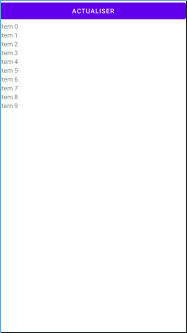
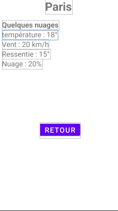

# Application météo android
Projet en développement mobile dans le cadre de ma formation d'ingénieur à l'ESIEA

## Présentation

Application qui donne l'état de la météo actuelles pour 20 station météo sur Paris et ses alentours. Pour cela, l'API REST OpenWeatherMap est utilisée (https://openweathermap.org/)

## Comment installer l'application

Compiler et installer le contenu de la branche master grâce à Android-Studio

## Consignes respectées

-Apelle à une API REST  
-Affichage d'une liste d'item dans une recyclerView dans un fragment  
-Affichage du détails d'un item dans un fragment  
-Stockage des données en cache  
-Workflow avec github  

### Tentative d'implémentation de fonctionnalitées non-abouties

-Ajout d'une barre de recherche (système de filtrage des item de la recyclerView)

## Fragments
### 1er fragment
Le 1er fragment montre une recyclerView dont chaque item est une ville pour laquelle il est précisé dans le footer de l'item la température et la vitesse du vent
Au lancement de l'application, une apelle API s'effectue et permet de fournir cette liste, sauf dans le cas où les données aurait été stockées en cache.

(L'pelle API ayant décidé d'arréter de fonctionner alors que le code n'a pas été modifié, je n'ai donc pas de screenshot à montrer mais seulement l'image suivante)  

### 2ème fragment
Ce fragment est affiché quand on clique sur l'item (ville) de la recyclerView du 1er fragment. Il contient le nom de la ville en question ainsi que des informations supplémentaire à propos de la météo actuelle de cette ville tel qu'une descriptio de la météo actuelle, la température ressentie et la couverture nuageuse.  

